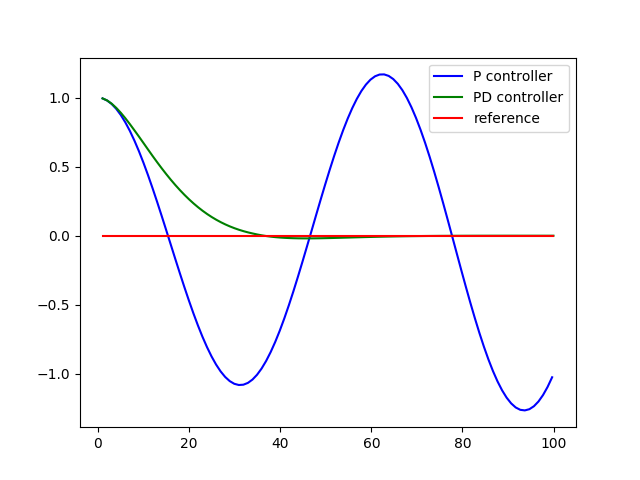
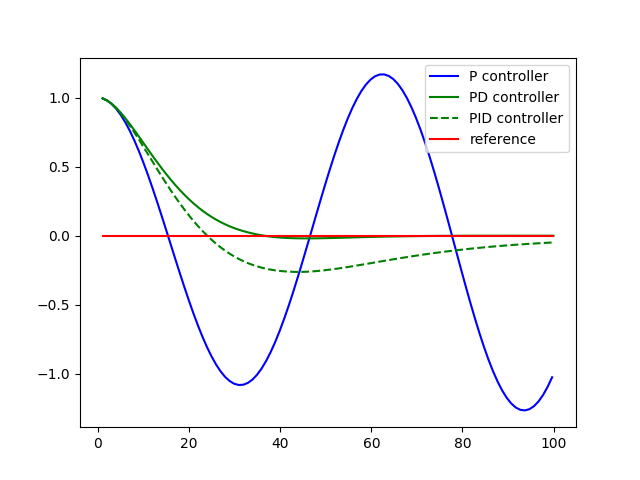

# PID Control

Control is how we use the steering, throttle, and brakes to move a car where we want it to go. In this unit we will learn how to implement a collection of important controllers.

When a human turns through an intersection, we use our intuition and experience to determine how hard to steer, when to accelerate, and whether to step on the brakes. Control algorithms are often called controllers and one of the most common and fundamental controllers is the **PID Controller**.

# Proportional Control

Assume we have a car with a steerable front axle and 2 non-steerable back wheels. We want the car to drive along a line, and the car has a fixed forward velocity, but we have the ability to set the steering angle of the car.

The best way to control the car in this case is to *steer proportionate to the __cross track error__*, which is the lateral distance between the vehicle and the so-called reference trajectory. This means the larger the error, the more you're willing to turn towards the target trajectory.

What we just learned is called a "P-Controller" where **P** stands for proportional. Suppose we steer in proportion to the cross track error. That is, your steering angle is proportional by come factor of **tau** to the cross track error. What will happen to the car? It will overshoot its target. The problem is that - no matter how small this **tau** constant is - it will eventually turn its wheels towards its trajectory. Then it will move towards its trajectory more and more. When it hits it, it's wheels will be straight, but the robot itself will still be oriented a little bit downwards, so it is forced to overshoot.

This means that when applied to a car, a P-controller will slightly overshoot (which could be OK if it is only a little bit). The overshooting is very small. It never really converges. It'll be what's called "marginally stable" or often just "stable".

------

### Coding A P-Controller

In the code below, there is a class "robot" that we have used before. It has an "init", a **set()** function, and a **set_noise()**function. There is also a function called **set_steering_drift()** which we won't look at just now. There is also a **move()** method.

Our goal is to implement the **run()** command, which takes as input the control parameter that governs the proportional response of the steering angle to the cross track error. The robot has an initial position of 0, 1, and 0 with a speed of 1, and a simulation consisting of 100 steps **N**.

Our robot is initially off the x-axis by 1. We want the car to drive along the **x**-axis so that the **y**-value is the same as the cross track error. By turning inversely proportional to the **y**-value using a parameter **tau** that sets the response strength of the proportional controller. We want the robot to turn towards the **x**-axis, drive in that direction, overshoot, turn around, drive back. To do this, simulate the world for 800 steps, and use a proportionality term that sets my steering angle **alpha** in proportion to the cross track error **y**. 

```python
# Implement a P controller by running 100 iterations
# of robot motion. The desired trajectory for the 
# robot is the x-axis. The steering angle should be set
# by the parameter tau so that:
#
# steering = -tau * crosstrack_error
#
# You'll only need to modify the `run` function at the bottom.
 
import random
import numpy as np
import matplotlib.pyplot as plt

# this is the Robot class
class Robot(object):
    def __init__(self, length=20.0):
        """
        Creates robot and initializes location/orientation to 0, 0, 0.
        """
        self.x = 0.0
        self.y = 0.0
        self.orientation = 0.0
        self.length = length
        self.steering_noise = 0.0
        self.distance_noise = 0.0
        self.steering_drift = 0.0

    def set(self, x, y, orientation):
        """
        Sets a robot coordinate.
        """
        self.x = x
        self.y = y
        self.orientation = orientation % (2.0 * np.pi)

    def set_noise(self, steering_noise, distance_noise):
        """
        Sets the noise parameters.
        """
        # makes it possible to change the noise parameters
        # this is often useful in particle filters
        self.steering_noise = steering_noise
        self.distance_noise = distance_noise

    def set_steering_drift(self, drift):
        """
        Sets the systematical steering drift parameter
        """
        self.steering_drift = drift

    def move(self, steering, distance, tolerance=0.001, max_steering_angle=np.pi / 4.0):
        """
        steering = front wheel steering angle, limited by max_steering_angle
        distance = total distance driven, most be non-negative
        """
        if steering > max_steering_angle:
            steering = max_steering_angle
        if steering < -max_steering_angle:
            steering = -max_steering_angle
        if distance < 0.0:
            distance = 0.0

        # apply noise
        steering2 = random.gauss(steering, self.steering_noise)
        distance2 = random.gauss(distance, self.distance_noise)

        # apply steering drift
        steering2 += self.steering_drift

        # Execute motion
        turn = np.tan(steering2) * distance2 / self.length

        if abs(turn) < tolerance:
            # approximate by straight line motion
            self.x += distance2 * np.cos(self.orientation)
            self.y += distance2 * np.sin(self.orientation)
            self.orientation = (self.orientation + turn) % (2.0 * np.pi)
        else:
            # approximate bicycle model for motion
            radius = distance2 / turn
            cx = self.x - (np.sin(self.orientation) * radius)
            cy = self.y + (np.cos(self.orientation) * radius)
            self.orientation = (self.orientation + turn) % (2.0 * np.pi)
            self.x = cx + (np.sin(self.orientation) * radius)
            self.y = cy - (np.cos(self.orientation) * radius)

    def __repr__(self):
        return '[x=%.5f y=%.5f orient=%.5f]' % (self.x, self.y, self.orientation)

robot = Robot()
robot.set(0, 1, 0)

def run(robot, tau, n=100, speed=1.0):
    x_trajectory = []
    y_trajectory = []
    for i in range(n):
        cte = robot.y
        steer = -tau * cte
        robot.move(steer, speed)
        x_trajectory.append(robot.x)
        y_trajectory.append(robot.y)
    return x_trajectory, y_trajectory
    
x_trajectory, y_trajectory = run(robot, 0.1)
n = len(x_trajectory)

fig, (ax1, ax2) = plt.subplots(2, 1, figsize=(8, 8))
ax1.plot(x_trajectory, y_trajectory, 'g', label='P controller')
ax1.plot(x_trajectory, np.zeros(n), 'r', label='reference')
```

The cross track error, **cte** is the current y position of the robot (our reference is a horizontal line) along the x-axis. To get the steering value we multiply the **tau** parameter with the **cte**. We then call the **move** method which causes the robot to move based on the **steer** and **speed** values. Add the **x** and **y** coordinates to the respective lists and then return them at the end.

# Oscillations

Oscillate - move or swing back and forth at a regular speed, vary in magnitude or position in a regular manner around a central point

```python
robot = Robot()
robot.set(0, 1, 0)

def run(robot, tau, n=100, speed=1.0):
    x_trajectory = []
    y_trajectory = []
    for i in range(n):
        cte = robot.y
        steer = -tau * cte
        robot.move(steer, speed)
        x_trajectory.append(robot.x)
        y_trajectory.append(robot.y)
    return x_trajectory, y_trajectory
    
x_trajectory, y_trajectory = run(robot, 0.1)  <-- tau parameter changes from 0.1 to 0.3
n = len(x_trajectory)
```

Tau, the control parameter, changes from 0.1 to 0.3. What happens?

It will oscillate faster. For the larger value of 0.3, we reach a negative value in **y** already, which means we just crossed the line after 13 steps.

# PD Controller

Is there a way to avoid the overshoot? It would be nice if we could do this because driving in an oscillating car can make people sick. The trick to solve this problem is called the **PD-Control**.

In PD-Control my steering **alpha** is not just related to the cross track error by virtue of the gain parameter **tau_p**, but also to the temporal derivative of the cross track error. What this means is that when the car has turned enough to reduce the cross track error, it won't just go shooting for the **x**-axis, but it will notice that it's already reducing the error. The error is becoming smaller over time, it counter steers, it steers up again, and this will allow it to gracefully approach our target trajectory, assuming appropriate settings of our differential gain - **tau_d** versus the proportional gain **tau_p**. But how do we compute this derivative? At time **t** this is the same as the cross track error at time **t - the cross track error at time t-1 divided by the time span between t and t-1**. In our code we assume **delta_t** equals 1, so we can omit this. The difference of the current cross track error and the previous one is the term **d/dt * cross track error**. We now control not just in proportion to the error itself, but also to this difference of the error using a second constant **tau d**.

### Code

```python
# Implement a PD controller by running 100 iterations
# of robot motion. The steering angle should be set
# by the parameter tau_p and tau_d so that:
#
# steering = -tau_p * CTE - tau_d * diff_CTE
# where differential crosstrack error (diff_CTE)
# is given by CTE(t) - CTE(t-1)
 
import random
import numpy as np
import matplotlib.pyplot as plt

# Robot class
class Robot(object):
    def __init__(self, length=20.0):
        """
        Creates robot and initializes location/orientation to 0, 0, 0.
        """
        self.x = 0.0
        self.y = 0.0
        self.orientation = 0.0
        self.length = length
        self.steering_noise = 0.0
        self.distance_noise = 0.0
        self.steering_drift = 0.0

    def set(self, x, y, orientation):
        """
        Sets a robot coordinate.
        """
        self.x = x
        self.y = y
        self.orientation = orientation % (2.0 * np.pi)

    def set_noise(self, steering_noise, distance_noise):
        """
        Sets the noise parameters.
        """
        # makes it possible to change the noise parameters
        # this is often useful in particle filters
        self.steering_noise = steering_noise
        self.distance_noise = distance_noise

    def set_steering_drift(self, drift):
        """
        Sets the systematical steering drift parameter
        """
        self.steering_drift = drift

    def move(self, steering, distance, tolerance=0.001, max_steering_angle=np.pi / 4.0):
        """
        steering = front wheel steering angle, limited by max_steering_angle
        distance = total distance driven, most be non-negative
        """
        if steering > max_steering_angle:
            steering = max_steering_angle
        if steering < -max_steering_angle:
            steering = -max_steering_angle
        if distance < 0.0:
            distance = 0.0

        # apply noise
        steering2 = random.gauss(steering, self.steering_noise)
        distance2 = random.gauss(distance, self.distance_noise)

        # apply steering drift
        steering2 += self.steering_drift

        # Execute motion
        turn = np.tan(steering2) * distance2 / self.length

        if abs(turn) < tolerance:
            # approximate by straight line motion
            self.x += distance2 * np.cos(self.orientation)
            self.y += distance2 * np.sin(self.orientation)
            self.orientation = (self.orientation + turn) % (2.0 * np.pi)
        else:
            # approximate bicycle model for motion
            radius = distance2 / turn
            cx = self.x - (np.sin(self.orientation) * radius)
            cy = self.y + (np.cos(self.orientation) * radius)
            self.orientation = (self.orientation + turn) % (2.0 * np.pi)
            self.x = cx + (np.sin(self.orientation) * radius)
            self.y = cy - (np.cos(self.orientation) * radius)

    def __repr__(self):
        return '[x=%.5f y=%.5f orient=%.5f]' % (self.x, self.y, self.orientation)

def run(robot, tau_p, tau_d, n=100, speed=1.0):
    x_trajectory = []
    y_trajectory = []
    prev_cte = robot.y
    for i in range(n):
        cte = robot.y
        diff_cte = cte - prev_cte
        prev_cte = cte
        steer = -tau_p * cte - tau_d * diff_cte
        robot.move(steer, speed)
        x_trajectory.append(robot.x)
        y_trajectory.append(robot.y)
    return x_trajectory, y_trajectory

# previous P controller
def run_p(robot, tau, n=100, speed=1.0):
    x_trajectory = []
    y_trajectory = []
    for i in range(n):
        cte = robot.y
        steer = -tau * cte
        robot.move(steer, speed)
        x_trajectory.append(robot.x)
        y_trajectory.append(robot.y)
    return x_trajectory, y_trajectory
    
robot = Robot()
robot.set(0, 1, 0)

def run(robot, tau_p, tau_d, n=100, speed=1.0):
    x_trajectory = []
    y_trajectory = []
    # TODO: your code here
    return x_trajectory, y_trajectory
    
x_trajectory, y_trajectory = run(robot, 0.2, 3.0)
n = len(x_trajectory)

fig, (ax1, ax2) = plt.subplots(2, 1, figsize=(8, 8))
ax1.plot(x_trajectory, y_trajectory, 'g', label='PD controller')
ax1.plot(x_trajectory, np.zeros(n), 'r', label='reference')
```

This is very similar to the P controller. We've added the **prev_cte** variable which is assigned to the previous CTE and **diff_cte**, the difference between the current CTE and previous CTE. We then put it all together with the new **tau_d** parameter to calculate the new steering value, **-tau_p * cte - tau_d * diff_cte**.



```python
cross_track_error = myrobot.y
for i in range(N):
	diff_cross_track_error = myrobot.y - cross_track_error
	cross_track_error = myrobot.y
	steer = - param1 * crosstrack_error \ - param2 * diff_cross_track_error
	myrobot = myrobot.move(steer, speed)
	print myrobot, steer
```

# Systematic Bias

There is a problem in robotics called "systematic bias". When you ordered your car, you believed the front wheels were 100% aligned, but your mechanic made a mistake and he aligned the wheels a little bit at an angle. For people, that isn't a big concern. When we notice this we just steer a little bit stronger, but how will our proportional controller react? We will set the steering drift to be 10 degrees, which in radians is 10.0/180.0*pi, using the **set_steering_drift()** method.

#### What happens when you run my proportional controller with parameter 0.2, and the differential controller set to 0?

It causes a big cross track error. Put differently, the robot oscillates with a fairly constant new offset error due to this bias. Even if the bias was steering, it manifests itself as an increased cross track error in the **y** direction.

#### Can the differential term solve this problem?

No. The **y** error is still large. is will still converge, but it is still large.

# PID Implementation

If you drive a car and your normal steering mode leads you to a trajectory far away from the goal, then what I submit you do is you notice over a long period of time you can't get closer. So you start steering more and more the more time goes by to the right to compensate this bias. You adjust to the bias. As a result, when you drive you steer the car a bit more. To do so we need a sustained situation of large error. That's measured by the integral, or the sum of the cross track errors over time. Let's make a new controller where steering is proportional to the cross track errors before is is equally proportional to the differential of the cross track error, but now it is also proportional to what's called the integral of the sum of all the cross track errors you ever observed. If we have a constant cross track error of 0.8, and the sume will increase by 0.8 for each time unit, it'll become larger and eventually it'll correct the robot's motion. This is called a **PID Controller**. 


The integrated cross track error is the sum of all cross track errors you have ever observed

### Code

```python
# -----------
# User Instructions
#
# Implement a P controller by running 100 iterations
# of robot motion. The steering angle should be set
# by the parameter tau so that:
#
# steering = -tau_p * CTE - tau_d * diff_CTE - tau_i * int_CTE
#
# where the integrated crosstrack error (int_CTE) is
# the sum of all the previous crosstrack errors.
# This term works to cancel out steering drift.
#
# Only modify code at the bottom! Look for the TODO.
# ------------

import random
import numpy as np
import matplotlib.pyplot as plt

# ------------------------------------------------
# 
# this is the Robot class
#

class Robot(object):
    def __init__(self, length=20.0):
        """
        Creates robot and initializes location/orientation to 0, 0, 0.
        """
        self.x = 0.0
        self.y = 0.0
        self.orientation = 0.0
        self.length = length
        self.steering_noise = 0.0
        self.distance_noise = 0.0
        self.steering_drift = 0.0

    def set(self, x, y, orientation):
        """
        Sets a robot coordinate.
        """
        self.x = x
        self.y = y
        self.orientation = orientation % (2.0 * np.pi)

    def set_noise(self, steering_noise, distance_noise):
        """
        Sets the noise parameters.
        """
        # makes it possible to change the noise parameters
        # this is often useful in particle filters
        self.steering_noise = steering_noise
        self.distance_noise = distance_noise

    def set_steering_drift(self, drift):
        """
        Sets the systematical steering drift parameter
        """
        self.steering_drift = drift

    def move(self, steering, distance, tolerance=0.001, max_steering_angle=np.pi / 4.0):
        """
        steering = front wheel steering angle, limited by max_steering_angle
        distance = total distance driven, most be non-negative
        """
        if steering > max_steering_angle:
            steering = max_steering_angle
        if steering < -max_steering_angle:
            steering = -max_steering_angle
        if distance < 0.0:
            distance = 0.0

        # apply noise
        steering2 = random.gauss(steering, self.steering_noise)
        distance2 = random.gauss(distance, self.distance_noise)

        # apply steering drift
        steering2 += self.steering_drift

        # Execute motion
        turn = np.tan(steering2) * distance2 / self.length

        if abs(turn) < tolerance:
            # approximate by straight line motion
            self.x += distance2 * np.cos(self.orientation)
            self.y += distance2 * np.sin(self.orientation)
            self.orientation = (self.orientation + turn) % (2.0 * np.pi)
        else:
            # approximate bicycle model for motion
            radius = distance2 / turn
            cx = self.x - (np.sin(self.orientation) * radius)
            cy = self.y + (np.cos(self.orientation) * radius)
            self.orientation = (self.orientation + turn) % (2.0 * np.pi)
            self.x = cx + (np.sin(self.orientation) * radius)
            self.y = cy - (np.cos(self.orientation) * radius)

    def __repr__(self):
        return '[x=%.5f y=%.5f orient=%.5f]' % (self.x, self.y, self.orientation)

############## ADD / MODIFY CODE BELOW ####################
# ------------------------------------------------------------------------
#
# run - does a single control run

robot = Robot()
robot.set(0, 1, 0)


def run(robot, tau_p, tau_d, tau_i, n=100, speed=1.0):
    x_trajectory = []
    y_trajectory = []
    prev_cte = robot.y
    int_cte = 0
    for i in range(n):
        cte = robot.y
        diff_cte = cte - prev_cte
        prev_cte = cte
        int_cte += cte
        steer = -tau_p * cte - tau_d * diff_cte - tau_i * int_cte
        robot.move(steer, speed)
        x_trajectory.append(robot.x)
        y_trajectory.append(robot.y)
    return x_trajectory, y_trajectory


x_trajectory, y_trajectory = run(robot, 0.2, 3.0, 0.004)
n = len(x_trajectory)

fig, (ax1, ax2) = plt.subplots(2, 1, figsize=(8,8))
ax1.plot(x_trajectory, y_trajectory, 'g', label='PID controller')
ax1.plot(x_trajectory, np.zeros(n), 'r', label='reference')
```

Ok. With the integral term we're keeping track of all the previous CTEs, initially we set int_cte to 0 and then add the current cte term to the count int_cte += cte. Finally we update the steering value, -tau_p * cte - tau_d * diff_cte - tau_i * int_cte with the new tau_i parameter.

```python
def run(robot, tau_p, tau_d, tau_i, n=100, speed=1.0):
    x_trajectory = []
    y_trajectory = []
    prev_cte = robot.y
    int_cte = 0
    for i in range(n):
        cte = robot.y
        diff_cte = cte - prev_cte
        prev_cte = cte
        int_cte += cte
        steer = -tau_p * cte - tau_d * diff_cte - tau_i * int_cte
        robot.move(steer, speed)
        x_trajectory.append(robot.x)
        y_trajectory.append(robot.y)
    return x_trajectory, y_trajectory
```



```python
int_cross_track_error = 0.0

cross_track_error = myrobot.y

for i in range(N):
	diff_cross_track_error = myrobot.y - cross_track_error
	cross_track_error = myrobot.y
	int_cross_track_error += cross_track_error
	steer = - param1 * cross_track_error \ - param2 * diff_cross_track_error \ - param3 * int_cross_track_error
	myrobot = myrobot.move(steer, speed)
	print myrobot, steer
```

# Twiddle

In Twiddle we're trying to optimize for a set of parameters. To do so, our function **run()** must return a **goodness** that should be the average cross track error. We want to implement Twiddle to minimize the average cross track error. The output depends on the three parameters: 

Build a parameter vector of our 3-target parameters, and initialize it with zero. Also, build a vector of potential changes that you want to probe and initialize them to 1 for now. Then we can run our **run()** method with our parameters, and whatever is outputs is our best error so far. Now we which to modify **p** as to make the error smaller. This is where Twiddle comes in, it's a really smart algorithm. We sequentially go through these parameters for i in len(**P**). Inside this loop we first increase **p[i]** by our probing value **dp[i]** and then compute the new error for this modified **p** by setting a new variable **err* to the output of **run(p)**. If this new error is greater than our best error, then we do two things. First we set **best_err** to **err*, and then we modify our **dp** to a slightly larger value by multiplying it with 1.1. If our new error is not larger than our best error, we subtract **dp** from **p[i]** - and we do it twice now since we added it before.


That is the core of Twiddle. For each coordinate in isolation it moves our parameter down a little bit by the **dp** value. If it then finds a better solution, it retains it, and it even increments the probing interval. If it fails to find a better solution, it goes back to the original and decreases our probing interval. We do this entire process so long as the sum of the **dp**'s is larger than the threshold.

------

### Code

```python
# ----------------
# User Instructions
#
# Implement twiddle as shown in the previous two videos.
# Your accumulated error should be very small!
#
# You don't have to use the exact values as shown in the video
# play around with different values! This quiz isn't graded just see
# how low of an error you can get.
#
# Try to get your error below 1.0e-10 with as few iterations
# as possible (too many iterations will cause a timeout).
#
# No cheating!
# ------------

import random
import numpy as np
import matplotlib.pyplot as plt

# ------------------------------------------------
# 
# this is the Robot class
#

class Robot(object):
    def __init__(self, length=20.0):
        """
        Creates robot and initializes location/orientation to 0, 0, 0.
        """
        self.x = 0.0
        self.y = 0.0
        self.orientation = 0.0
        self.length = length
        self.steering_noise = 0.0
        self.distance_noise = 0.0
        self.steering_drift = 0.0

    def set(self, x, y, orientation):
        """
        Sets a robot coordinate.
        """
        self.x = x
        self.y = y
        self.orientation = orientation % (2.0 * np.pi)

    def set_noise(self, steering_noise, distance_noise):
        """
        Sets the noise parameters.
        """
        # makes it possible to change the noise parameters
        # this is often useful in particle filters
        self.steering_noise = steering_noise
        self.distance_noise = distance_noise

    def set_steering_drift(self, drift):
        """
        Sets the systematical steering drift parameter
        """
        self.steering_drift = drift

    def move(self, steering, distance, tolerance=0.001, max_steering_angle=np.pi / 4.0):
        """
        steering = front wheel steering angle, limited by max_steering_angle
        distance = total distance driven, most be non-negative
        """
        if steering > max_steering_angle:
            steering = max_steering_angle
        if steering < -max_steering_angle:
            steering = -max_steering_angle
        if distance < 0.0:
            distance = 0.0

        # apply noise
        steering2 = random.gauss(steering, self.steering_noise)
        distance2 = random.gauss(distance, self.distance_noise)

        # apply steering drift
        steering2 += self.steering_drift

        # Execute motion
        turn = np.tan(steering2) * distance2 / self.length

        if abs(turn) < tolerance:
            # approximate by straight line motion
            self.x += distance2 * np.cos(self.orientation)
            self.y += distance2 * np.sin(self.orientation)
            self.orientation = (self.orientation + turn) % (2.0 * np.pi)
        else:
            # approximate bicycle model for motion
            radius = distance2 / turn
            cx = self.x - (np.sin(self.orientation) * radius)
            cy = self.y + (np.cos(self.orientation) * radius)
            self.orientation = (self.orientation + turn) % (2.0 * np.pi)
            self.x = cx + (np.sin(self.orientation) * radius)
            self.y = cy - (np.cos(self.orientation) * radius)

    def __repr__(self):
        return '[x=%.5f y=%.5f orient=%.5f]' % (self.x, self.y, self.orientation)

############## ADD / MODIFY CODE BELOW ####################
# ------------------------------------------------------------------------
#
# run - does a single control run


def make_robot():
    """
    Resets the robot back to the initial position and drift.
    You'll want to call this after you call `run`.
    """
    robot = Robot()
    robot.set(0, 1, 0)
    robot.set_steering_drift(10 / 180 * np.pi)
    return robot


# NOTE: We use params instead of tau_p, tau_d, tau_i
def run(robot, params, n=100, speed=1.0):
    x_trajectory = []
    y_trajectory = []
    err = 0
    # TODO: your code here
    prev_cte = robot.y
    int_cte = 0
    for i in range(2 * n):
        cte = robot.y
        diff_cte = cte - prev_cte
        int_cte += cte
        prev_cte = cte
        steer = -params[0] * cte - params[1] * diff_cte - params[2] * int_cte
        robot.move(steer, speed)
        x_trajectory.append(robot.x)
        y_trajectory.append(robot.y)
        if i >= n:
            err += cte ** 2
    return x_trajectory, y_trajectory, err / n


def twiddle(tol=0.2): 
    p = [0, 0, 0]
    dp = [1, 1, 1]
    robot = make_robot()
    x_trajectory, y_trajectory, best_err = run(robot, p)

    it = 0
    while sum(dp) > tol:
        print("Iteration {}, best error = {}".format(it, best_err))
        for i in range(len(p)):
            p[i] += dp[i]
            robot = make_robot()
            x_trajectory, y_trajectory, err = run(robot, p)

            if err < best_err:
                best_err = err
                dp[i] *= 1.1
            else:
                p[i] -= 2 * dp[i]
                robot = make_robot()
                x_trajectory, y_trajectory, err = run(robot, p)

                if err < best_err:
                    best_err = err
                    dp[i] *= 1.1
                else:
                    p[i] += dp[i]
                    dp[i] *= 0.9
        it += 1
    return p


params, err = twiddle()
print("Final twiddle error = {}".format(err))
robot = make_robot()
x_trajectory, y_trajectory, err = run(robot, params)
n = len(x_trajectory)

fig, (ax1, ax2) = plt.subplots(2, 1, figsize=(8, 8))
ax1.plot(x_trajectory, y_trajectory, 'g', label='Twiddle PID controller')
ax1.plot(x_trajectory, np.zeros(n), 'r', label='reference')
```

This follows Sebastian's pseudocode very closely. Before each run we make a new Robot with make_robot, ensuring on each run the robot starts from the same position. You may find it fruitful to change the magic numbers altering p and dp.

```python
def twiddle(tol=0.2): 
    p = [0, 0, 0]
    dp = [1, 1, 1]
    robot = make_robot()
    x_trajectory, y_trajectory, best_err = run(robot, p)

    it = 0
    while sum(dp) > tol:
        print("Iteration {}, best error = {}".format(it, best_err))
        for i in range(len(p)):
            p[i] += dp[i]
            robot = make_robot()
            x_trajectory, y_trajectory, err = run(robot, p)

            if err < best_err:
                best_err = err
                dp[i] *= 1.1
            else:
                p[i] -= 2 * dp[i]
                robot = make_robot()
                x_trajectory, y_trajectory, err = run(robot, p)

                if err < best_err:
                    best_err = err
                    dp[i] *= 1.1
                else:
                    p[i] += dp[i]
                    dp[i] *= 0.9
        it += 1
    return p
```


